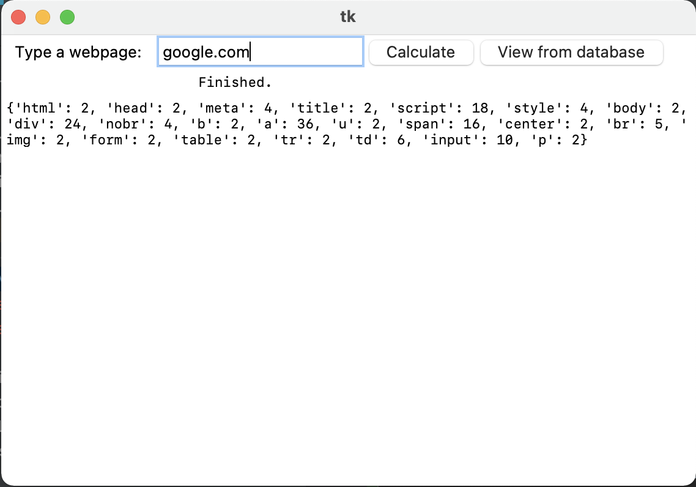

# html_tag_counter
This program counts HTML tags on the corresponding webpage. All requests are being saved to the SQLite database "requests.db". Information can be given from this database via the special parameter "--view". Also all requests are being logged to the separate file "requests.log". Also there is a file "synonims.yaml" with synonims for different domain names.  
```
bash$ tagcounter --help
Usage: tagcounter [OPTIONS]

Options:
  --get TEXT   Get number of HTML tags on the webpage.
  --view TEXT  Read saved data from database for the corresponding webpage.
  --help       Show this message and exit.
  ```
Example:  
```buildoutcfg
bash$ tagcounter --get google.com
2021-08-10 10:02:27.067 | INFO     | tagcounter.main:count:93 - http://www.google.com/
{'html': 2, 'head': 2, 'meta': 4, 'title': 2, 'script': 18, 'style': 4, 'body': 2, 'div': 24, 'nobr': 4, 'b': 2, 'a': 36, 'u': 2, 'span': 16, 'center': 2, 'br': 5, 'img': 2, 'form': 2, 'table': 2, 'tr': 2, 'td': 6, 'input': 10, 'p': 2}

bash$ tagcounter --view facebook.com
{'html': 2, 'head': 2, 'meta': 36, 'script': 32, 'style': 2, 'noscript': 2, 'link': 54, 'title': 2, 'body': 2, 'div': 86, 'span': 18, 'a': 92, 'i': 8, 'img': 4, 'h2': 2, 'form': 2, 'input': 12, 'button': 2, 'ul': 4, 'li': 82}

bash$ tagcounter --get ggl
2021-08-10 10:07:40.148 | INFO     | tagcounter.main:count:93 - http://www.google.com/
{'html': 2, 'head': 2, 'meta': 4, 'title': 2, 'script': 18, 'style': 4, 'body': 2, 'div': 24, 'nobr': 4, 'b': 2, 'a': 36, 'u': 2, 'span': 16, 'center': 2, 'br': 5, 'img': 2, 'form': 2, 'table': 2, 'tr': 2, 'td': 6, 'input': 10, 'p': 2}
```
If you launch this program without corresponding parameters, it will be launched in GUI:  
  
